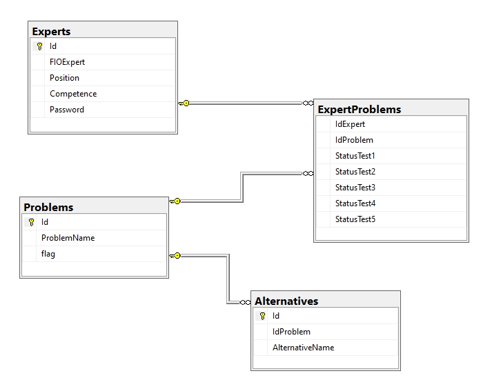

Решение неструктурированных проблем методами экспертных оценок
========================

### Общая характеристика методов экспертных оценок

  Методы экспертных оценок применяются в тех случаях, когда математическая формализация проблем либо невозможна в силу их новизны и сложности, либо требует больших затрат времени и средств. Общим для всех методов экспертных оценок является обращение к опыту, знаниям и интуиции специалистов, выполняющих функции экспертов. Давая ответы на поставленный вопрос, эксперты являются поставщиками информации, которая анализируется и обобщается. Если в диапазоне ответов имеется истинный ответ, то совокупность разрозненных мнений
может быть эффективно синтезирована в некоторое обобщенное мнение, близкое к реальности. Любой метод экспертных оценок представляет собой совокупность процедур, направленных на получение информации эвристического происхождения и ее обработку.

### О приложении

Данное Windows-приложение разработано в среде Visual Studio 2019 и предназначено для работы нескольких экспертов и одного аналитика. Принцип работы предельно прост. Аналитик задает список проблем с их возможными решениями (альтернативами), а также вносит данные об экспертах. Эксперты оценивают альтернативы пятью различными методами. Результаты пройденных оцениваний сохраняются в txt-файлы, после чего становятся доступны к изучению в интерфейсе аналитика.

Файл database.mdf содержит базу данных, в которой хранится информация об экспертах, их пройденных оцениваниях, проблемах и альтернативах.

#### Диаграмма базы данных

Основные функции:
- Добавление\удаление\редактирование проблем
- Добавление\удаление\редактирование альтернатив
- Добавление\удаление\редактирование экспертов
- Назначение и удаление проблем экспертам
- Оценивание альтернатив пятью различными методами
- Просмотр результатов оценивания

### Структура репозитория
MyProject1 - основные файлы проекта, исходники  
Release - скомпилированные файлы  
Setup - установочные файлы. Созданы при помощи расширения Microsoft Visual Studio Installer Projects.  
